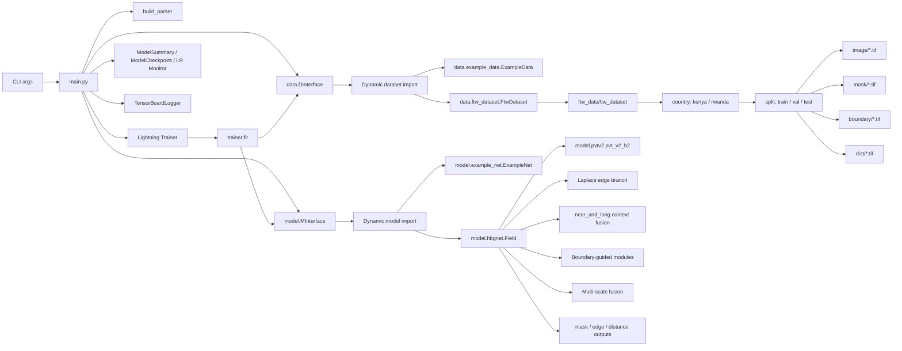
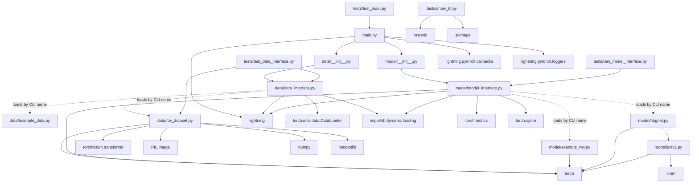

# Project Graph

Generated for `E:\ZuoProject\ZuoPro`.

## Runtime Architecture

## Source Module Dependencies

## Key Extension Points

- Add a dataset as `data/<snake_case>.py` with matching `CamelCase` class; select it with `--train_dataset`, `--val_datasets`, or `--test_datasets`.
- Add a model as `model/<snake_case>.py` with matching `CamelCase` class; select it with `--model_name`.
- Dataset and model constructors receive only matching CLI keyword arguments, filtered through `inspect.signature`.
- FTW data is discovered from `ftw_data/ftw_dataset/<country>/<split>/image/*.tif` and paired with sibling `mask`, `boundary`, and `dist` folders.
